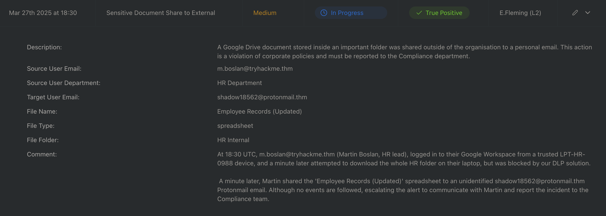

>It is essential to document what you see in the SIEM and determine if it needs to be escalated. 

### 5W 
when who what where why

### Example

At 18:30 UTC(WHEN), m.boslan@tryhackme.thm (Martin Boslan, HR lead)(WHO), logged in to their Google Workspace(WHAT) from a trusted LPT-HR-0988 device, and a minute later attempted to download the whole HR folder on their laptop(WHERE), but was blocked by our DLP solution.(WHY)

 A minute later, Martin shared the 'Employee Records (Updated)' spreadsheet to an unidentified shadow18562@protonmail.thm Protonmail email. Although no events are followed, escalating the alert to communicate with Martin and report the incident to the Compliance team.

