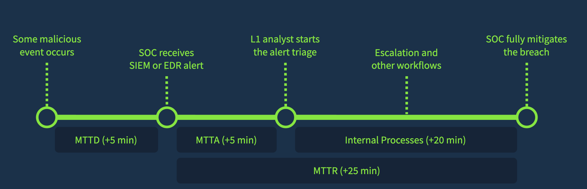

>L1 is the front line of defense. It’s crucial for L1 analysts to use metrics to measure how well security policies are actually working and to escalate any gaps or inefficiencies to the right people so the overall system keeps improving.

### Some Metrics: (you want them on a resonable number)
- FPR - False Positive Rate
- AES - Alert Escalation Rate
- TDE - Threat Detection Rate

### Service Level Agrement
A document about requirements on SOC Metrics such as MTTD, MTTA, MTTR... (something used to evaluate a L1 analyst's performance!)

